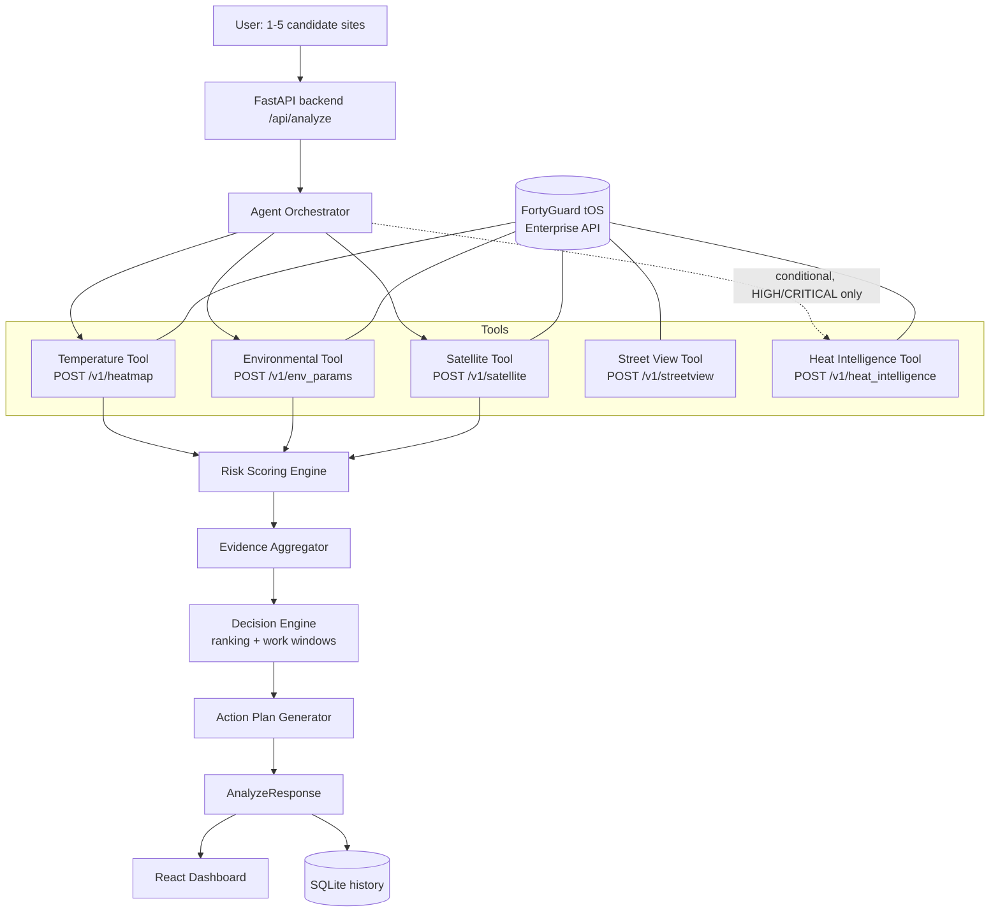

# HeatWise Agent

**Autonomous Hyperlocal Heat Intelligence for Safer Decisions.**

Built for the FortyGuard Hackathon'26 ("Building the World's Temperature AI").

## Problem

Outdoor teams — construction crews, delivery fleets, utility workers, city
operations — make heat-exposure decisions using city-level weather
forecasts. But heat doesn't vary at the city scale: a parking lot and a
tree-lined park two blocks apart can differ by several degrees and a very
different solar and surface profile. Generic weather data can't tell a
crew which of three candidate sites is actually safer this afternoon, or
when in the day to schedule the highest-exposure work.

## Solution

HeatWise Agent is an autonomous decision system built on FortyGuard's
hyperlocal Temperature API. Given one to five candidate sites, it
independently:

1. Pulls real, tile-level temperature intelligence for each site
2. Pulls solar, thermal-comfort, and land-cover context
3. Calculates a transparent 0–100 Operational Risk Score
4. Decides — on its own — whether the situation warrants a deeper,
   credit-costing Heat Intelligence investigation
5. Ranks the sites, explains *why* one is preferred, and generates a
   work-window schedule and a prioritized action plan

## AI Agent Workflow

```
OBSERVE  →  ANALYZE  →  INVESTIGATE  →  DECIDE  →  ACT
```

- **OBSERVE** — `POST /v1/heatmap` for real hyperlocal temperature at each site
- **ANALYZE** — `POST /v1/env_params` (solar, heat index, humidity) and
  `POST /v1/satellite` (canopy / impervious surface) feed the risk engine
- **INVESTIGATE** — the agent only calls the expensive
  `POST /v1/heat_intelligence` report when the computed risk is HIGH or
  CRITICAL (or the user explicitly forces it) — conserving API credits on
  low-risk sites
- **DECIDE** — sites are ranked by Operational Risk Score; the agent states
  which evidence drove the ranking
- **ACT** — a safe-work-window timeline and a prioritized, evidence-cited
  action plan are generated per site

## Architecture



## FortyGuard API Usage

| API Capability | Endpoint | How HeatWise Uses It |
|---|---|---|
| Temperature / Heatmap | `POST /v1/heatmap` | Real hyperlocal temperature for each site, via a small buffer polygon around the site's coordinates |
| Environmental Parameters | `POST /v1/env_params` | Heat index, humidity, and clear-sky solar irradiance (GHI/DNI/DHI) |
| Satellite Segmentation | `POST /v1/satellite` | Tree canopy and impervious-surface coverage around the site |
| Street View Segmentation | `POST /v1/streetview` | Ground-level shade/canopy context (retrieved, available for future UI use) |
| Heat Intelligence | `POST /v1/heat_intelligence` | Deep investigation PDF, requested only when computed risk is HIGH/CRITICAL |

All temperature values are used in the API's native °C internally;
Fahrenheit is a display-only conversion, matching the convention the
official FortyGuard quickstart's own use-case notebooks follow.

## Project Structure

```
heatwise-agent/
├── backend/
│   ├── fortyguard/        # Vendored, unmodified official FortyGuard client
│   ├── agent/              # Orchestrator, risk engine, decision engine, demo data
│   ├── services/            # FortyGuard service wrapper, geo helpers
│   ├── models/               # Pydantic schemas
│   ├── database/              # SQLite history storage
│   ├── tests/                  # pytest suite
│   ├── main.py                  # FastAPI app
│   ├── requirements.txt
│   └── .env.example
├── frontend/
│   └── src/                      # React + TypeScript + Tailwind dashboard
├── docs/
│   ├── PROJECT_SUMMARY.md
│   ├── DEMO_SCRIPT.md
│   ├── API_USAGE.md
│   └── ARCHITECTURE.md
└── README.md
```

## Setup

### Prerequisites
- Python 3.10+
- Node 18+
- A FortyGuard API key (optional — the app runs fully in Demo Mode without one)

### Backend

```bash
cd backend
python3 -m venv .venv && source .venv/bin/activate
pip install -r requirements.txt
cp .env.example .env   # then paste your FORTYGUARD_API_KEY
uvicorn main:app --reload --port 8000
```

### Frontend

```bash
cd frontend
npm install
npm run dev
```

Open `http://localhost:5173`. The Vite dev server proxies `/api/*` to the
backend on port 8000.

### Run tests

```bash
cd backend
pytest
```

## Environment Variables

See `backend/.env.example`:

```
FORTYGUARD_API_KEY=your_api_key_here
FORTYGUARD_BASE_URL=https://api.fortyguard.com
FRONTEND_ORIGIN=http://localhost:5173
```

`FORTYGUARD_API_KEY` is read server-side only (`backend/services/fortyguard_service.py`
via the vendored client) and is never sent to the frontend, logged, or
included in error responses (see `test_error_handling.py::test_status_endpoint_never_leaks_api_key`).

## Demo Mode

If no API key is configured, or a live call fails mid-analysis, HeatWise
falls back to a bundled **Phoenix Outdoor Workforce Scenario** — three
sites with distinct, realistic heat profiles. Every demo response is
explicitly labeled `"data_source": "demo"` per-site and a `DEMO DATA — not
live API results` banner is shown in the UI. Live data is never silently
replaced with demo data without saying so.

## Limitations

HeatWise Agent is an **operational decision-support prototype**. The
"HeatWise Operational Risk Score" is not a medically certified heat-health
index. This tool does not replace official weather alerts, occupational
safety regulations (e.g. OSHA heat rules), or medical advice — always defer
to official guidance and your organization's safety policies.

## Third-party code disclosure

`backend/fortyguard/` (`client.py`, `exceptions.py`, `__init__.py`) is
copied **verbatim, unmodified**, from FortyGuard's own official
`temperature-api-quickstart` repository
(https://github.com/FortyGuard-Tech/temperature-api-quickstart) — it is
FortyGuard's own API client, not code authored for this hackathon. Every
other file in this repository (agent logic, risk scoring, FastAPI backend,
React frontend, tests, docs) was written for this submission.